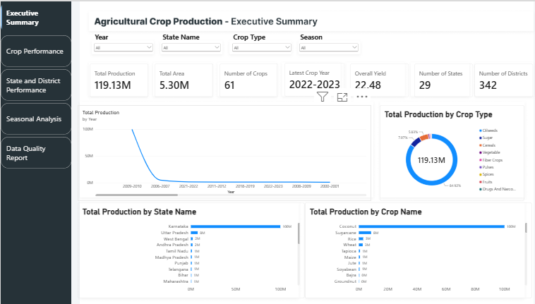
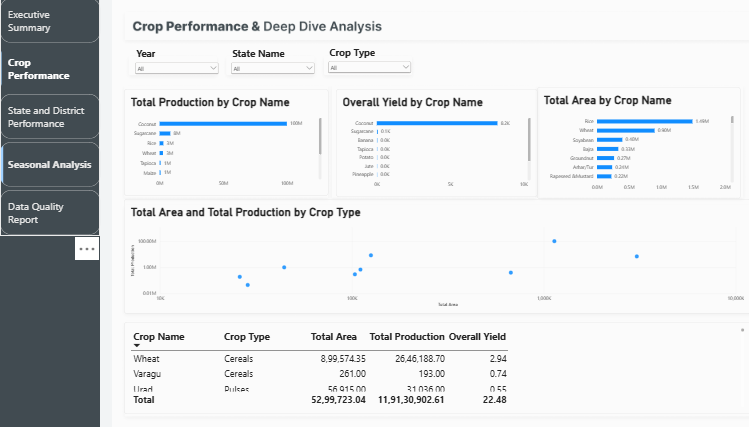
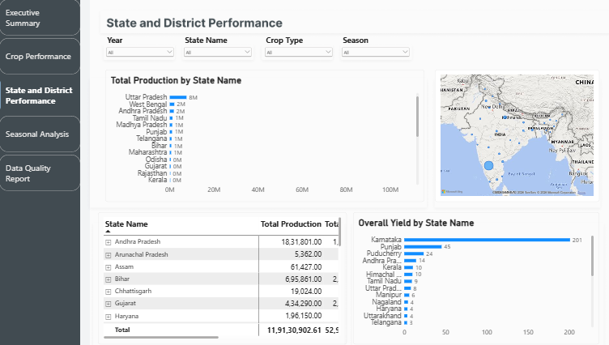
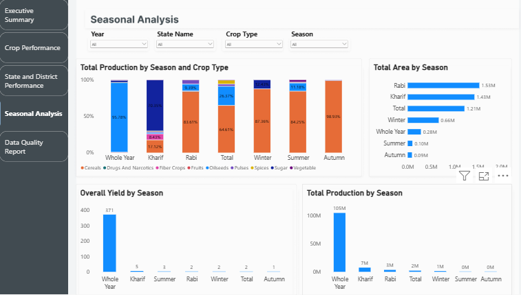
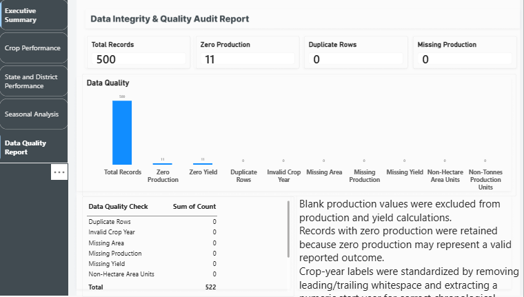

# Agricultural Crop Production Analysis

An end-to-end data analysis and MIS dashboard project that analyses agricultural crop production, cultivated area, and yield across Indian states, districts, crop types, seasons, and crop years.

The project uses Python and Pandas for data cleaning, validation, transformation, and exploratory analysis, followed by Power BI and DAX for interactive KPI reporting and dashboard development.

---

## Project Objective

The objective of this project is to build an interactive Agricultural Crop Production MIS Dashboard that helps users monitor:

- Total crop production and cultivated area
- Overall agricultural yield
- Crop-wise and crop-type-wise performance
- State-wise and district-wise production performance
- Seasonal production patterns
- Data quality issues such as missing production, zero production, duplicate records, and inconsistent values

The dashboard is designed to support data-driven agricultural planning by identifying high-performing crops and regions, low-productivity areas, and seasonal trends.

---

## Business Questions Answered

This project answers the following business questions:

1. What are the total production, total cultivated area, and overall yield?
2. Which states and districts contribute the highest agricultural production?
3. Which crops have the highest total production, cultivated area, and yield?
4. Which crop types contribute the most to total production?
5. How has crop production changed across crop years?
6. Which seasons contribute the highest production and cultivated area?
7. Which states have high cultivated area but low productivity?
8. Which districts are the leading producers within each state?
9. Which crop and crop-type combinations perform best across seasons?
10. Are there missing, duplicate, zero-value, or invalid records in the dataset?

---

## Dataset Overview

The dataset contains agricultural crop records across multiple Indian states and districts.

| Column | Description |
|---|---|
| `Year` | Agricultural/crop year, such as `2018-2019` |
| `State Name` | Name of the Indian state |
| `State Code` | State identification code |
| `District Name` | Name of the district |
| `District Code` | District identification code |
| `Crop Name` | Name of the crop |
| `Crop Code` | Crop identification code |
| `Crop Type` | Category such as Cereals, Pulses, Oilseeds, Vegetables, Fruits, etc. |
| `Season` | Crop season such as Kharif, Rabi, Summer, Winter, Whole Year, etc. |
| `Area` | Cultivated area |
| `Area Unit` | Unit of cultivated area, primarily Hectare |
| `Production` | Crop production |
| `Production Unit` | Unit of production, primarily Tonnes |
| `Yield` | Yield available in the source dataset |
| `Yield Unit` | Unit of yield, primarily Tonnes/Hectare |

> **Note:** The `Year` field represents a crop-year period, not one specific calendar date. For example, `2018-2019` represents an agricultural reporting period.

---

## Tools and Technologies

- **Python**
- **Pandas**
- **NumPy**
- **Jupyter Notebook**
- **Power BI Desktop**
- **DAX**
- **Microsoft Excel** *(optional, if used for checking/exporting data)*
- **GitHub**

---

## Data Cleaning and Preparation

The following cleaning and transformation steps were performed using Python and Pandas:

- Removed leading/trailing whitespace and newline characters from the `Year` column.
- Extracted `start_year` from the crop-year field for chronological sorting.
- Converted `Area`, `Production`, and `Yield` to numeric data types.
- Checked missing values in all columns.
- Identified blank production records.
- Identified zero-production and zero-yield records.
- Checked duplicate records.
- Validated crop-year formatting.
- Checked area, production, and yield units.
- Created a clean analysis dataset for reporting.
- Calculated weighted yield using total production divided by total cultivated area.

### Crop-Year Cleaning Example

```python
df["Year"] = df["Year"].astype("string").str.strip()

df["start_year"] = (
    df["Year"]
    .str.split("-")
    .str
    .astype("Int64")
)
```

### Weighted Yield Formula

A simple average of row-level yield can be misleading because small and large farms would receive equal weight. Therefore, the project uses weighted yield:

\[
\text{Weighted Yield} =
\frac{\text{Total Production}}{\text{Total Cultivated Area}}
\]

Python implementation:

```python
overall_yield = (
    df["Production"].sum() /
    df["Area"].sum()
)
```

---

## Key Performance Indicators

The dashboard includes the following key KPIs:

- Total Production (Tonnes)
- Total Cultivated Area (Hectares)
- Overall Weighted Yield (Tonnes/Hectare)
- Number of States Covered
- Number of Districts Covered
- Number of Crops Covered
- Latest Crop Year

---

## Dashboard Pages

### 1. Executive Summary

The Executive Summary provides a high-level view of agricultural performance.

**KPIs:**

- Total Production
- Total Cultivated Area
- Overall Yield
- States Covered
- Districts Covered
- Crops Covered
- Latest Crop Year

**Visuals:**

- Production trend by crop year
- Production by crop type
- Top 10 states by production
- Top 10 crops by production
- Interactive slicers for Year, State, Crop Type, Crop Name, and Season

### 2. Crop Performance Analysis

This page evaluates crop-level performance.

**Key questions:**

- Which crops have the highest production?
- Which crops have the highest yield?
- Which crops occupy the largest cultivated area?
- Which crop types contribute most to production?

**Visuals:**

- Crop-wise total production bar chart
- Crop-wise weighted yield bar chart
- Crop-wise cultivated area bar chart
- Area versus production scatter chart
- Crop performance table with production rank

### 3. State and District Performance

This page evaluates geographic production performance.

**Key questions:**

- Which states produce the most?
- Which states have the best weighted yield?
- Which districts lead within each state?
- Which regions show low productivity?

**Visuals:**

- State-wise production ranking
- State-wise weighted yield ranking
- State-to-district drill-down matrix
- Geographic map of production by state
- District-level crop performance analysis

### 4. Seasonal Analysis

This page compares agricultural performance across seasons.

**Key questions:**

- Which season contributes the highest production?
- Which season has the largest cultivated area?
- Does yield differ by season?
- Which crop types dominate Kharif, Rabi, Summer, Winter, and Whole Year categories?

**Visuals:**

- Production by season
- Cultivated area by season
- Yield by season
- Crop type by season matrix
- Stacked chart of crop type contribution by season

### 5. Data Quality Report

This page documents data quality checks performed before analysis.

**Checks included:**

- Total record count
- Missing area values
- Missing production values
- Missing yield values
- Zero-production records
- Zero-yield records
- Duplicate records
- Invalid crop-year values
- Area-unit consistency
- Production-unit consistency

---

## DAX Measures

The Power BI dashboard uses a small set of dynamic DAX measures so all cards and visuals update when a user applies filters or slicers.

```DAX
Total Production =
SUM(agriculture_cleaned_data[Production])
```

```DAX
Total Cultivated Area =
SUM(agriculture_cleaned_data[Area])
```

```DAX
Overall Yield =
DIVIDE(
    [Total Production],
    [Total Cultivated Area],
    0
)
```

```DAX
Number of States =
DISTINCTCOUNT(agriculture_cleaned_data[State Name])
```

```DAX
Number of Districts =
DISTINCTCOUNT(agriculture_cleaned_data[District Name])
```

```DAX
Number of Crops =
DISTINCTCOUNT(agriculture_cleaned_data[Crop Name])
```

```DAX
Latest Crop Year =
VAR LatestStartYear =
    MAX(agriculture_cleaned_data[start_year])
RETURN
    CALCULATE(
        MAX(agriculture_cleaned_data[Year]),
        agriculture_cleaned_data[start_year] = LatestStartYear
    )
```

---

## Project Structure

```text
agricultural-crop-production-mis-dashboard/
│
├── data/
│   ├── raw/
│   │   └── Crop-Wise-Area-Production-Yield_Sample_Data.csv
│   │
│   └── processed/
│       └── agriculture_cleaned_data.csv
│
├── notebooks/
│   └── agricultural_crop_analysis.ipynb
│
├── powerbi/
│   └── Agricultural_Crop_Production_MIS_Dashboard.pbix
│
├── dashboard_screenshots/
│   ├── 01_executive_summary.png
│   ├── 02_crop_performance.png
│   ├── 03_state_district_analysis.png
│   ├── 04_seasonal_analysis.png
│   └── 05_data_quality_report.png
│
├── README.md
├── requirements.txt
└── .gitignore
```

---

## Dashboard Preview

Add your dashboard screenshots below after uploading them to the `dashboard_screenshots` folder.

### Executive Summary



### Crop Performance



### State and District Performance



### Seasonal Analysis



### Data Quality Report



---

## Key Insights

Update this section after completing the Power BI dashboard. Use the actual results from your dashboard.

- **Top-producing state:** `<Karnataka>` recorded the highest total crop production.
- **Top-producing crop:** `<Coconut>` contributed the highest total production.
- **Largest crop category:** `<Oilseed>` was the leading crop category by production.
- **Best-performing season:** `<Kharif>` recorded the highest agricultural production.
- **High-yield crop:** `<Coconut>` showed high weighted yield among crops with meaningful cultivated area.
- **Low-productivity opportunity:** `<Rajasthan>` had comparatively low yield despite a large cultivated area.
- **Data quality finding:** `<98>` records had missing production values and were handled during analysis.

---

## How to Run the Project

### 1. Clone the repository

```bash
git clone <(https://github.com/varun222121/agricultural-crop-production-mis-dashboard.git)>
```

### 2. Install Python libraries

```bash
pip install pandas numpy jupyter
```

### 3. Run the notebook

Open Jupyter Notebook:

```bash
jupyter notebook
```

Then run:

```text
notebooks/agricultural_crop_analysis.ipynb
```

### 4. Open the dashboard

Open the following file using Power BI Desktop:

```text
powerbi/Agricultural_Crop_Production_MIS_Dashboard.pbix
```

---

## Skills Demonstrated

- Data Cleaning and Data Validation
- Exploratory Data Analysis
- Missing Value Handling
- Data Type Conversion
- Feature Engineering
- KPI Development
- Data Aggregation
- Weighted Yield Calculation
- Power BI Dashboard Development
- DAX Measures
- Interactive Slicers and Drill-Down Analysis
- Data Visualization
- Business Reporting and MIS Reporting
- GitHub Project Documentation

---

## Future Improvements

- Add rainfall, temperature, irrigation, soil type, fertilizer use, and market-price data.
- Create crop-production forecasts using machine learning.
- Add year-over-year production growth metrics.
- Build a state comparison page with benchmarking.
- Add a mobile-friendly Power BI dashboard layout.
- Automate data refresh using Power BI Service.
- Create a separate dashboard focused on a selected state or crop.

---

## Author

**<Varun Mukhi>**

- LinkedIn: <www.linkedin.com/in/varun-mukhi-09715125a>
- GitHub: <https://github.com/varun222121>
- Email: <varun.guru23@gmail.com>

---

## Disclaimer

This project is created for learning, portfolio development, and data-analysis practice. The insights depend on the quality, coverage, and definitions used in the source dataset.
